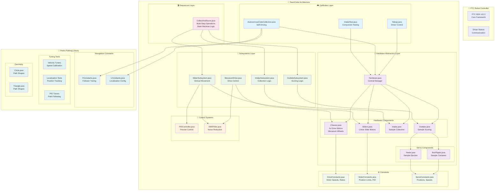

# FTC Robot Controller Architecture Infographic

## 📋 Architecture Overview

### 🏗️ **Layered Architecture Pattern**

1. **OpModes Layer** 🎮
   - Entry points for robot programs
   - Handle user input and match flow
   - Coordinate high-level robot behavior

2. **Hardware Abstraction Layer** 🔧
   - Single source of truth for hardware mapping
   - Encapsulates physical device configuration
   - Provides clean interface to hardware components

3. **Subsystems Layer** 🎯
   - Business logic for robot mechanisms
   - State management and control algorithms
   - Coordinate multiple hardware components

4. **Control Systems** 🧠
   - PID controllers for precise movement
   - Filtering for sensor noise reduction
   - Real-time feedback control

5. **Sequences Layer** 🎬
   - Complex multi-step operations
   - State machine implementations
   - Coordinated subsystem interactions

6. **Configuration Layer** ⚙️
   - Centralized constants and parameters
   - Easy tuning without code changes
   - Runtime configuration via FTC Dashboard

### 🌟 **Key Design Patterns**

- **Hardware Abstraction**: Single `Hardware.java` manages all devices
- **Subsystem Architecture**: Each major mechanism has dedicated logic
- **State Machines**: Complex sequences use enum-based states
- **PID Control**: Precise movement with feedback loops
- **Constants Pattern**: Centralized configuration management
- **Integration Pattern**: Pedro Pathing for advanced autonomous

### 🎯 **INTO THE DEEP Season Specific**

- **Sample Handling**: Multi-servo sequences for game pieces
- **Vertical Movement**: PID-controlled linear slides
- **Collection System**: Intake with tube-based collection
- **Scoring System**: Box flipper and yeeter for placement
- **Advanced Navigation**: Pedro Pathing integration

### 🔄 **Data Flow**

1. **OpMode** receives input/commands
2. **Subsystems** process high-level commands
3. **Hardware** translates to device operations
4. **Control Systems** provide precise execution
5. **Constants** provide tuning parameters
6. **Sequences** coordinate complex operations

This architecture provides modularity, testability, and easy maintenance for competitive FTC robotics.